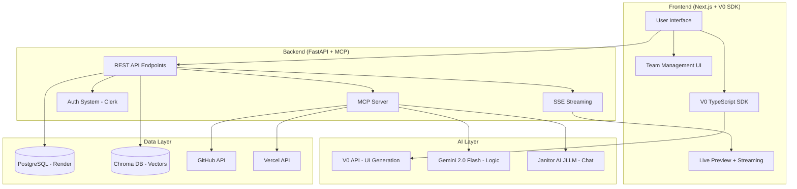

# OPS-X: One-Prompt Startup Platform - Complete Implementation Plan

**Cal Hacks 12.0 - October 24-26, 2025**

> **Mission**: Build a platform where anyone can generate a full-stack application from a single prompt, collaborate with their team through AI-powered branching, and deploy to production—all within minutes.

---

## 📊 Executive Summary

**What We're Building**: An AI-powered platform that transforms a single prompt into a deployable web application, complete with:
- One-prompt MVP generation using V0
- Multi-stakeholder collaboration with AI-suggested branching
- Real-time code refinement without rebuilding from scratch
- Semantic code search with Chroma DB
- GitHub integration for version control
- Vercel deployment for instant hosting

**Current Status**: **65% Complete** (MVP Core + Database)

**Target Launch**: Sunday, October 26, 2025 @ 10:30 PDT

---

## 🎯 Prize Categories We're Targeting

### Primary Targets (High Confidence)

1. **Best Use of Chroma** - $200 per team member
   - ✅ **Status**: Implemented
   - **What We Built**: Semantic code search engine that stores embeddings of all generated code, enabling natural language search across the entire codebase
   - **Implementation**: `backend/integrations/chroma_client.py` with `ChromaCodeSearch` class, storing embeddings for every file generated by V0

2. **Build a Multiplayer AI Chat Experience (Janitor AI)** - $200K internship + AirPods Max
   - 🟡 **Status**: 30% Complete
   - **What We're Building**: Real-time multiplayer chat where team members collaborate on project refinements with role-aware AI assistants
   - **Implementation**: `backend/mcp/chat_summarize.py` stub created, need to integrate JLLM API (endpoint: `https://janitorai.com/hackathon/completions`, context: 25K tokens)

3. **Best MCP Automation (Interaction Company)** - Meta Ray-Bans + AirPods Pro 3 + TNF Jackets
   - 🟡 **Status**: 40% Complete
   - **What We're Building**: FastMCP server exposing build, repo management, conflict detection, chat memory, pitch generation, and YC application tools
   - **Implementation**: 
     - ✅ `backend/mcp/app_build_v0.py` (V0 generation)
     - ✅ `backend/mcp/repo_patch.py` (GitHub operations)
     - ✅ `backend/mcp/chat_summarize.py` (Janitor AI integration)
     - 🔴 `backend/mcp/conflict_scan.py` (needs CodeRabbit integration)
     - 🔴 `backend/mcp/pitch_generate.py` (needs Gemini integration)
     - 🔴 `backend/mcp/yc_pack.py` (needs YC application generator)

4. **Best Use of Postman** - iPad (11th Gen) / Sony Headphones / JBL Speaker
   - 🔴 **Status**: 10% Complete
   - **What We're Building**: Postman Flows agent that orchestrates multi-API workflows (GitHub + Vercel + V0 + Gemini) with reasoning and error handling
   - **Implementation**: `backend/mcp/postman_flow.py` stub created, need to build multi-API orchestration

5. **Best Use of CodeRabbit AI** - Meta Ray-Ban AI Glasses
   - 🟡 **Status**: 20% Complete
   - **What We're Building**: Automated PR reviewer for all code refinements, providing AI-powered feedback before merging
   - **Implementation**: Need to integrate CodeRabbit API with `backend/api/branches.py` and `backend/mcp/conflict_scan.py`

### Secondary Targets (Stretch Goals)

6. **Best Use of Claude** - Tungsten Cube + $5000 API Credits
   - 🔴 **Status**: 0% Complete
   - **Pivot Option**: Replace Gemini with Claude for all code generation and reasoning tasks

7. **Build an Iconic YC Company** - Guaranteed YC Partner Interview
   - 🟡 **Status**: Planning Phase
   - **What We're Building**: YC application generator that analyzes the codebase, generates pitch decks, and creates a complete YC application from the project

8. **Most Complex / Technically Challenging (Cal Hacks)** - Macbook Airs / Framework Laptops
   - 🟡 **Status**: 70% Complete
   - **Why We Qualify**: 
     - Multi-model AI orchestration (V0 + Gemini)
     - Real-time streaming architecture
     - Dual-database system (PostgreSQL + Chroma)
     - MCP server implementation
     - GitHub + Vercel integration

---

## 🏗️ Overall System Architecture



---

## 📋 Detailed Feature Breakdown

### Phase 1: Core MVP Generation (✅ 95% Complete)

**Goal**: One-prompt to deployed application

**Status**: **Working in production**

#### 1.1 V0 Integration (✅ Complete)
- **Location**: `frontend/src/app/actions/v0.ts`
- **What It Does**:
  - Takes user prompt
  - Creates V0 chat using TypeScript SDK
  - Streams real-time code generation
  - Returns 10+ files (components, pages, utils, types)
- **Tech Stack**: V0 TypeScript SDK, Next.js Server Actions
- **API Key**: `v1:RPFdMvkqfXKjtpuSXZsVMxU8:MvPE7ACUpMlqJ81LdAgj20VA`

#### 1.2 GitHub Integration (✅ Complete)
- **Location**: `backend/integrations/github_api.py`
- **What It Does**:
  - Creates new GitHub repository
  - Initializes with README
  - Pushes all V0-generated files
  - Creates branches for team members
- **API**: GitHub REST API v3
- **Endpoints**:
  - `create_repo(name, description)` → returns `repo_url`
  - `push_multiple_files(repo_name, files_dict)` → pushes code
  - `create_branch(repo_name, branch_name, base_branch)` → creates feature branch

#### 1.3 Live Preview & Streaming (✅ Complete)
- **Location**: `frontend/src/hooks/useStreamingBuild.ts`, `frontend/src/components/BuildWithPreview.tsx`
- **What It Does**:
  - Displays live preview in iframe (V0's preview URL)
  - Shows real-time build progress
  - Streams file generation updates
  - Shows file tree as code is generated
- **Tech**: Server-Sent Events (SSE), React hooks, shadcn/ui

#### 1.4 Database Persistence (✅ Complete)
- **Location**: `backend/database.py`, `backend/models.py`
- **What It Does**:
  - Stores projects, stakeholders, branches, chat messages
  - Relational data in PostgreSQL (Render)
  - Vector embeddings in Chroma DB
- **Schema**:
  ```sql
  projects (id, name, prompt, status, github_repo, app_url, v0_chat_id, owner_id)
  stakeholders (id, project_id, user_id, name, email, role, github_branch)
  branches (id, project_id, stakeholder_id, branch_name, github_repo, status)
  chat_messages (id, project_id, user_id, message, role, is_ai, extra_data)
  code_embeddings (id, project_id, file_path, content, embedding)
  ```

---

### Phase 2: Team Collaboration (🟡 40% Complete)

**Goal**: Multi-stakeholder project management with AI-powered branching

**Status**: **Backend complete, frontend UI needed**

#### 2.1 Stakeholder Management (✅ Backend Complete)
- **Location**: `backend/api/stakeholders.py`
- **Endpoints**:
  - `POST /api/projects/{id}/stakeholders` - Add team member
  - `GET /api/projects/{id}/stakeholders` - List team
  - `PATCH /api/projects/{id}/stakeholders/{sid}` - Update member
  - `DELETE /api/projects/{id}/stakeholders/{sid}` - Remove member
- **Roles**: Founder, Frontend, Backend, Investor, Facilitator
- **What's Missing**: 🔴 Frontend UI for team management

#### 2.2 AI Branch Suggestions (✅ Backend Complete)
- **Location**: `backend/api/branches.py`
- **How It Works**:
  1. User adds stakeholder (name, role, project context)
  2. Gemini generates contextual branch name
     - Example: "Frontend engineer Sarah on SaaS Dashboard" → `feat/sarah-dashboard-ui`
  3. GitHub API creates actual branch
  4. Branch URL stored in database
- **Endpoints**:
  - `POST /api/projects/{id}/branches/suggest` - Get AI suggestion
  - `POST /api/projects/{id}/branches` - Create branch
  - `GET /api/projects/{id}/branches` - List branches
- **What's Missing**: 🔴 Frontend UI for branch management

#### 2.3 Authentication & Authorization (🔴 0% Complete - CRITICAL)
- **Planned Tech**: Clerk (recommended) or Firebase Auth
- **What We Need**:
  - Sign up / Log in modal
  - Email + OTP verification
  - Google / GitHub OAuth
  - Admin vs team member roles
  - Session persistence
- **Flow**:
  ```
  1. User creates MVP (anonymous or signed in)
  2. After generation, prompt: "Invite your team?"
  3. If yes → Redirect to sign up/login modal
  4. User signs in → Project ownership assigned
  5. Can now invite team members via email
  6. Team members get OTP link → Sign in → Access project
  ```
- **Database Changes Needed**:
  ```sql
  users (id, email, hashed_password, created_at)
  sessions (id, user_id, token, expires_at)
  project_permissions (id, project_id, user_id, role, access_level)
  ```

---

### Phase 3: Code Refinement (🔴 20% Complete - HIGH PRIORITY)

**Goal**: Iterative refinement without rebuilding from scratch

**Status**: **Architecture designed, needs implementation**

#### 3.1 V0 Chat Continuity (✅ Architecture Complete)
- **How It Works** (using V0 SDK docs):
  ```typescript
  // Initial build
  const chat = await v0.chats.create({
    message: "Build a SaaS dashboard",
    projectId: project_id
  })
  // Store chat.id in database → project.v0_chat_id

  // Refinement (same chat!)
  const refinement = await v0.chats.sendMessage({
    chatId: stored_chat_id,  // From database
    message: "Add dark mode toggle to navbar"
  })
  // V0 only returns CHANGED files, not entire codebase
  ```

- **Endpoints Needed**:
  - `POST /api/projects/{id}/refine` - Submit refinement request
  - `POST /api/projects/{id}/pr/create` - Create PR after refinement
  - `GET /api/projects/{id}/refinements` - List all refinements

- **What's Missing**:
  - 🔴 Frontend refinement UI
  - 🔴 V0 SDK integration for chat continuation
  - 🔴 GitHub PR creation logic
  - 🔴 CodeRabbit review integration

#### 3.2 Pull Request Workflow (🔴 0% Complete)
- **Flow**:
  ```
  1. User submits refinement prompt
  2. V0 continues chat → Returns modified files
  3. Backend pushes changes to stakeholder's branch
  4. Backend creates GitHub PR (base: main, head: stakeholder-branch)
  5. CodeRabbit auto-reviews PR
  6. Team reviews + merges
  ```

- **GitHub API Methods Needed**:
  ```python
  def create_pull_request(repo_name, head_branch, base_branch, title, description):
      # POST /repos/{owner}/{repo}/pulls
      pass

  def get_pr_status(repo_name, pr_number):
      # GET /repos/{owner}/{repo}/pulls/{pr_number}
      pass

  def merge_pull_request(repo_name, pr_number):
      # PUT /repos/{owner}/{repo}/pulls/{pr_number}/merge
      pass
  ```

---

### Phase 4: AI Agents & Chat (🟡 30% Complete)

**Goal**: Role-aware AI assistants + multiplayer collaboration

**Status**: **JLLM integration pending**

#### 4.1 Janitor AI Multiplayer Chat (🔴 30% Complete)
- **Prize Target**: $200K internship + AirPods Max
- **What We're Building**:
  - Real-time chat room per project
  - Multiple users + AI character
  - AI maintains context across users
  - Role-aware responses (founder vs engineer vs investor)
  
- **JLLM API Details**:
  ```python
  endpoint = "https://janitorai.com/hackathon/completions"
  api_key = "calhacks2047"
  context_length = 25000  # tokens
  
  # OpenAI-compatible format
  response = requests.post(endpoint, json={
      "messages": [
          {"role": "system", "content": "You are a technical facilitator..."},
          {"role": "user", "content": "How should we implement auth?"}
      ]
  }, headers={"Authorization": api_key})
  ```

- **Implementation Plan**:
  ```python
  # backend/mcp/chat_summarize.py
  class JanitorChatManager:
      def __init__(self):
          self.rooms = {}  # project_id -> ChatRoom
          self.ai_character = AICharacter(model="jllm")
      
      async def handle_message(self, project_id, user_id, message, role):
          # 1. Store in database
          # 2. Build context window (last 25K tokens)
          # 3. Include user roles in context
          # 4. Call JLLM API
          # 5. Broadcast AI response to all users
          pass
  ```

- **Frontend WebSocket**:
  ```typescript
  const ws = new WebSocket('ws://localhost:8000/chat/{project_id}')
  ws.onmessage = (event) => {
    const { sender, message, role, is_ai } = JSON.parse(event.data)
    // Display in chat UI
  }
  ```

#### 4.2 Specialized Agent System (🔴 10% Complete)
- **Agents**:
  - **Planner Agent**: Breaks down features into tasks
  - **Frontend Agent**: Suggests UI/UX improvements
  - **Backend Agent**: Proposes API architecture
  - **Investor Agent**: Analyzes market fit
  - **Facilitator Agent**: Mediates technical decisions

- **Agent Orchestration**:
  ```python
  # When user asks: "How should we build authentication?"
  1. Facilitator Agent receives question
  2. Routes to Backend Agent + Frontend Agent
  3. Backend Agent suggests FastAPI + JWT
  4. Frontend Agent suggests Clerk integration
  5. Facilitator Agent synthesizes + presents options
  ```

---

### Phase 5: MCP Server (🟡 40% Complete)

**Goal**: Expose all functionality as MCP tools for other agents

**Status**: **Core tools built, need refinement**

#### 5.1 Implemented MCPs (✅)

**`app_build`** - One-prompt app generation
```python
@router.post("/mcp/app/build")
async def build_app(request: AppBuildRequest):
    # Input: { project_name, prompt, requirements }
    # Output: { github_url, preview_url, files }
    pass
```

**`repo_patch`** - GitHub operations
```python
@router.post("/mcp/repo/patch")
async def patch_repo(repo_name, files, branch):
    # Pushes code changes to GitHub
    pass
```

**`chat_summarize`** - Janitor AI chat
```python
@router.post("/mcp/chat/summarize")
async def summarize_chat(project_id, user_message):
    # Returns AI response with context
    pass
```

#### 5.2 Pending MCPs (🔴)

**`conflict_scan`** - CodeRabbit integration
```python
@router.post("/mcp/conflict/scan")
async def scan_conflicts(project_id, pr_number):
    # 1. Get PR diff from GitHub
    # 2. Send to CodeRabbit for review
    # 3. Return conflicts + suggestions
    pass
```

**`pitch_generate`** - Gemini pitch deck
```python
@router.post("/mcp/pitch/generate")
async def generate_pitch(project_id):
    # 1. Analyze codebase from Chroma
    # 2. Generate pitch deck with Gemini
    # 3. Return markdown + PDF
    pass
```

**`yc_pack`** - YC application generator
```python
@router.post("/mcp/yc/pack")
async def generate_yc_application(project_id):
    # 1. Analyze project (Chroma semantic search)
    # 2. Generate YC-style answers
    # 3. Return full application
    pass
```

**`postman_flow`** - Multi-API orchestration
```python
@router.post("/mcp/postman/flow")
async def orchestrate_apis(workflow_definition):
    # 1. Parse workflow (GitHub → V0 → Vercel)
    # 2. Execute in sequence with error handling
    # 3. Return results + logs
    pass
```

---

## 🛠️ Technology Stack

### Frontend
- **Framework**: Next.js 14 (App Router)
- **UI Library**: shadcn/ui + Tailwind CSS
- **State Management**: React Context + Server Actions
- **Real-time**: SSE (Server-Sent Events) for streaming
- **V0 Integration**: V0 TypeScript SDK (`v0-sdk@0.15.0`)
- **Auth**: Clerk (planned)

### Backend
- **Framework**: FastAPI
- **MCP**: FastMCP (Model Context Protocol server)
- **Database**: 
  - PostgreSQL (Render) - Relational data
  - Chroma DB - Vector embeddings
- **AI Models**:
  - V0 (v0-1.5-md) - UI generation
  - Gemini 2.0 Flash - Logic & reasoning
  - Janitor AI JLLM - Multiplayer chat

### Infrastructure
- **Version Control**: GitHub API
- **Deployment**: Vercel API
- **Hosting**: 
  - Backend: Local (for hackathon), Railway (production)
  - Frontend: Vercel
  - Database: Render PostgreSQL

### Integrations
| Service | Status | Purpose |
|---------|--------|---------|
| V0 | ✅ Integrated | UI generation |
| GitHub | ✅ Integrated | Version control |
| Vercel | ⚠️ Partial | Deployment |
| Gemini | ✅ Integrated | AI reasoning |
| Chroma | ✅ Integrated | Vector search |
| Janitor AI | 🔴 Pending | Multiplayer chat |
| CodeRabbit | 🔴 Pending | PR reviews |
| Postman | 🔴 Pending | API orchestration |
| Clerk | 🔴 Pending | Authentication |

---

## 📈 Implementation Progress

### Completed (65%)
- [x] V0 integration (frontend SDK)
- [x] GitHub repo creation + file push
- [x] Live preview with V0 iframe
- [x] Real-time streaming (SSE)
- [x] PostgreSQL database setup
- [x] Chroma DB integration
- [x] Semantic code search
- [x] Stakeholder management API
- [x] AI branch name suggestions
- [x] GitHub branch creation
- [x] FastMCP server foundation
- [x] Basic MCP endpoints

### In Progress (25%)
- [ ] V0 refinement workflow (chat continuation)
- [ ] Janitor AI multiplayer chat
- [ ] CodeRabbit PR review integration
- [ ] Authentication system (Clerk)
- [ ] Team management UI
- [ ] Refinement UI

### Not Started (10%)
- [ ] Postman Flows agent
- [ ] YC application generator
- [ ] Pitch deck generator
- [ ] Investor agent
- [ ] Specialized agent orchestration

---

## 🎯 Milestones & Timeline

### Friday, Oct 24 (Day 1) - Foundation ✅
- [x] Project setup
- [x] Database schema
- [x] V0 integration
- [x] GitHub integration
- [x] Basic streaming

### Saturday, Oct 25 (Day 2) - Current Status
**Morning** (Completed ✅)
- [x] PostgreSQL migration
- [x] Chroma DB integration
- [x] Stakeholder APIs
- [x] Branch management

**Afternoon** (Next 6 hours - HIGH PRIORITY)
- [ ] Authentication (Clerk)
  - [ ] Sign up/login modal
  - [ ] Email + OTP
  - [ ] OAuth (Google/GitHub)
  - [ ] Session management
  - [ ] Project ownership

- [ ] Team Management UI
  - [ ] Stakeholder dashboard
  - [ ] Add team members form
  - [ ] Role assignment
  - [ ] Branch visualization

- [ ] V0 Refinement Flow
  - [ ] Chat continuation logic
  - [ ] Refinement UI
  - [ ] PR creation
  - [ ] File diff display

**Evening** (6-12 hours)
- [ ] Janitor AI Integration
  - [ ] JLLM API connection
  - [ ] Multiplayer chat room
  - [ ] Role-aware AI responses
  - [ ] WebSocket real-time updates

- [ ] CodeRabbit Integration
  - [ ] PR auto-review
  - [ ] Conflict detection
  - [ ] Suggestion display

### Sunday, Oct 26 (Day 3) - Polish & Submit
**Morning** (6 hours)
- [ ] Postman Flows agent
- [ ] YC application generator
- [ ] Pitch deck generator
- [ ] README.md generation (Gemini)
- [ ] Demo video recording

**10:30 AM** - Hacking ends, judging begins
- [ ] Final bug fixes
- [ ] Deploy to production
- [ ] Submit to prize categories
- [ ] Prepare demo for judges

---

## 🏆 Prize Submission Checklist

### Chroma
- [x] Code: `backend/integrations/chroma_client.py`
- [x] Semantic search: `POST /api/projects/{id}/search/semantic`
- [x] Embeddings stored after V0 generation
- [ ] Demo video showing semantic code search

### Janitor AI
- [ ] Real-time multiplayer chat room
- [ ] JLLM API integration (25K context)
- [ ] Role-aware AI responses
- [ ] Creative multi-user conversation handling
- [ ] Demo video (3-5 min)

### MCP Automation (Interaction Company)
- [x] FastMCP server running
- [ ] All 6 MCP tools implemented:
  - [x] app_build
  - [x] repo_patch
  - [x] chat_summarize
  - [ ] conflict_scan (CodeRabbit)
  - [ ] pitch_generate
  - [ ] yc_pack
- [ ] Demo video showing MCP usage

### Postman
- [ ] Postman Flows agent built
- [ ] Multi-API orchestration (GitHub + V0 + Vercel)
- [ ] Error handling & logging
- [ ] Public workspace shared
- [ ] Action URL + sample I/O

### CodeRabbit
- [ ] PR auto-review working
- [ ] Integrated with refinement workflow
- [ ] Demo of AI-powered code review

---

## 🚀 Deployment Plan

### Development (Current)
```
Backend: http://localhost:8000
Frontend: http://localhost:3000
Database: Render PostgreSQL (production)
Chroma: Local persistent storage
```

### Production (Sunday Morning)
```
Backend: Railway / Render
Frontend: Vercel
Database: Render PostgreSQL
Chroma: Hosted Chroma Cloud
```

### Environment Variables Required
```bash
# AI Services
V0_API_KEY=v1:RPFdMvkqfXKjtpuSXZsVMxU8:MvPE7ACUpMlqJ81LdAgj20VA
GEMINI_API_KEY=<your_key>

# GitHub
GITHUB_TOKEN=<your_token>

# Janitor AI
JANITOR_API_ENDPOINT=https://janitorai.com/hackathon/completions
JANITOR_API_KEY=calhacks2047

# Database
DATABASE_URL=postgresql://...
CHROMA_PERSIST_DIR=./chroma_data

# Auth (Clerk)
CLERK_SECRET_KEY=<your_key>
NEXT_PUBLIC_CLERK_PUBLISHABLE_KEY=<your_key>
```

---

## 🐛 Known Issues & Fixes

### 1. Timezone Error (✅ FIXED)
**Issue**: `NameError: name 'timezone' is not defined`
**Fix**: Added `from datetime import timezone` to `backend/api/projects.py`

### 2. V0 SDK Version Warning (⚠️ Minor)
**Issue**: `v0-sdk` requires Node >=22, we have Node 20
**Impact**: Non-blocking, SDK still works
**Fix**: Ignore for hackathon, upgrade Node in production

### 3. Chroma Telemetry Errors (⚠️ Minor)
**Issue**: `capture() takes 1 positional argument but 3 were given`
**Impact**: Non-blocking, just logging issue
**Fix**: Already using `PersistentClient`, errors are from legacy code

### 4. Server Auto-Reload Loops (⚠️ Minor)
**Issue**: Uvicorn detects file changes and reloads frequently
**Impact**: Slightly slower development
**Fix**: Normal behavior in dev mode with `--reload`

---

## 📚 Key Documentation Links

### APIs We're Using
- [V0 SDK Docs](https://v0.app/docs/api)
- [GitHub REST API](https://docs.github.com/en/rest)
- [Vercel API](https://vercel.com/docs/rest-api)
- [Gemini API](https://ai.google.dev/gemini-api/docs)
- [Chroma DB](https://docs.trychroma.com/)
- [Janitor AI JLLM](https://janitorai.com/hackathon)
- [CodeRabbit](https://coderabbit.ai/docs)
- [Postman Flows](https://learning.postman.com/docs/postman-flows/)
- [Clerk Auth](https://clerk.com/docs)

### Internal Docs
- `COMPLETE_BUILD_PLAN.md` - Original feature plan
- `DATABASE_SETUP.md` - PostgreSQL + Chroma setup
- `DATABASE_MIGRATION_COMPLETE.md` - Migration from in-memory
- `TESTING_GUIDE.md` - How to test backend APIs
- `SETUP_GUIDE.md` - Initial setup instructions

---

## 🎬 Demo Script (For Judges)

### 1. One-Prompt MVP (30 seconds)
```
1. Show homepage
2. Enter prompt: "Build a task management dashboard"
3. Show live preview appearing
4. Show file tree generating in real-time
5. Click GitHub link → Show repo with all code
```

### 2. Semantic Code Search (30 seconds)
```
1. Open project
2. Search: "Where is authentication logic?"
3. Show Chroma returning relevant files
4. Explain: "No exact text match, semantic understanding"
```

### 3. Team Collaboration (45 seconds)
```
1. Click "Invite Team"
2. Add stakeholder: Sarah (Frontend Engineer)
3. Show AI suggest branch: feat/sarah-dashboard-ui
4. Show GitHub branch created automatically
```

### 4. Refinement Workflow (45 seconds)
```
1. Click "Refine"
2. Enter: "Add dark mode toggle"
3. Show V0 continuing same chat
4. Show only changed files
5. Show PR created automatically
```

### 5. Multiplayer Chat (30 seconds)
```
1. Open chat room
2. Multiple users asking questions
3. AI responds to everyone contextually
4. Role-aware responses (founder vs engineer)
```

**Total**: 3 minutes → Perfect for judging rounds

---

## 🏁 Success Metrics

### Technical
- [ ] End-to-end MVP generation < 2 minutes
- [ ] Semantic search returns relevant results
- [ ] 5+ users in multiplayer chat simultaneously
- [ ] PR creation + CodeRabbit review < 30 seconds
- [ ] Zero crashes during demo

### Prize Goals
- **Primary**: Chroma + Janitor AI + MCP Automation = ~$3K + Ray-Bans + AirPods
- **Stretch**: Postman + CodeRabbit + YC Interview = iPad + Ray-Bans + Interview
- **Dream**: Overall Winner = MacBook Airs

---

## 👥 Team Structure

**Backend Engineer** (You):
- FastAPI MCP server
- Database (PostgreSQL + Chroma)
- AI integrations (Gemini, Janitor AI, CodeRabbit)
- GitHub + Vercel APIs
- Authentication backend

**Frontend Engineer** (Teammate):
- Next.js UI components
- V0 SDK integration
- Real-time streaming UI
- Team management dashboard
- Authentication UI (Clerk)

**Concurrent Work**:
- Backend builds APIs → Frontend builds UI consuming APIs
- Backend implements MCP tools → Frontend shows results
- Backend handles auth logic → Frontend shows login modals

---

## 🔥 Critical Path (Next 12 Hours)

### Priority 1 (MUST HAVE - 6 hours)
1. **Authentication** (2 hours)
   - Clerk integration
   - Sign up/login modal
   - Session persistence

2. **V0 Refinement** (2 hours)
   - Chat continuation
   - PR creation
   - Frontend UI

3. **Janitor AI Chat** (2 hours)
   - JLLM API integration
   - WebSocket real-time
   - Role-aware responses

### Priority 2 (SHOULD HAVE - 4 hours)
4. **Team Management UI** (1.5 hours)
   - Stakeholder dashboard
   - Branch visualization

5. **CodeRabbit Integration** (1.5 hours)
   - PR auto-review
   - Conflict detection

6. **Postman Flows** (1 hour)
   - Multi-API orchestration
   - Error handling

### Priority 3 (NICE TO HAVE - 2 hours)
7. **YC Generator** (1 hour)
8. **Pitch Deck** (1 hour)

---

## 📝 Notes & Pivots

### What We Changed
1. **Creao → V0**: Creao API doesn't exist publicly, pivoted to V0 for UI generation
2. **Gemini Only → V0 + Gemini**: V0 handles UI, Gemini handles logic (then removed Gemini backend, V0 now frontend-only)
3. **In-Memory → PostgreSQL + Chroma**: Migrated to production databases for persistence
4. **Backend V0 → Frontend V0**: Moved V0 logic to frontend using TypeScript SDK

### Design Decisions
- **Why FastMCP?**: Native MCP server support, easy to expose as tools
- **Why Chroma?**: Prize category + semantic search is genuinely useful
- **Why Clerk?**: Fastest auth integration, pre-built UI components
- **Why Render PostgreSQL?**: Free tier, reliable, fast setup

---

## 🎓 Lessons Learned

1. **Start with prizes in mind**: We picked tech stack based on prize categories
2. **MVP first, polish later**: Live preview was a game-changer for demos
3. **Database early**: Moving to PostgreSQL mid-hackathon was painful
4. **Frontend SDK > Backend**: V0 SDK on frontend is faster than backend proxy
5. **Real-time matters**: Streaming makes the app feel alive

---

**Last Updated**: Saturday, October 25, 2025 @ 10:30 PM PDT

**Next Review**: Sunday, October 26, 2025 @ 7:00 AM PDT (3 hours before deadline)

